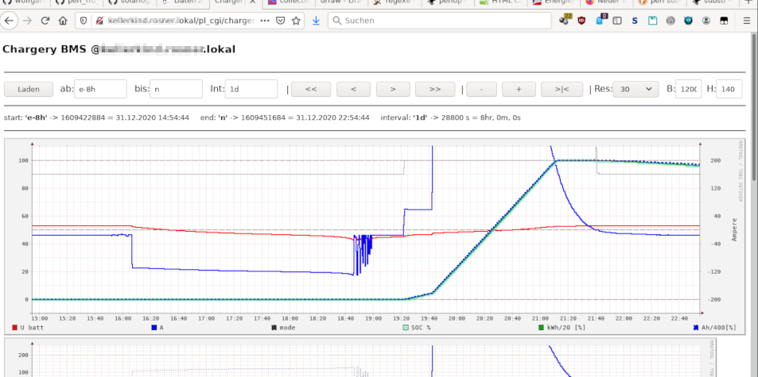

# perl_rrd_cgi
## boilerplate approach for simple rrd browsing on http

### Example
  
  
Notice the navigator line at the top of the page which allows easy time browsing through some preconfigured rrd databases 
of my choice and display them in a synchronized way.

### Inspirations
`drraw`: unfortunately not maintained for more than a decade, can't safe graph template.  
However, I still use it for some first start version for my graph definitions.  
Time to learn `rrdgraph` syntax, though...
  
`cacti`: looks great from the distance, but crazy from close up.  
If you managed to master it, maybe you are in the wrong place here.  
Or do you know what you are looking for?  
  
`collection3`: rendering companion of collectd system data rrd wizardry.  
Has flexible rendering dependign on `rrd`s it finds in a preconfigured set.  
Nice Java script navigator buttons on the charts, but I don't like client side scripting.  
Tried to bend the framework for my own `rrd`s, but too much overhead for my taste.  

### Rationale
Understand RRD, if you want to understand what follows.  
https://oss.oetiker.ch/rrdtool/  
Somewhat more flexible than rrdcgi,  
but less overhead and opacity layers than other +- well known heavyly bloated frameworks.  
In the end, PERL is a turing complete programming language, and HTML may be quite close to it.  
So, who needs more?  
Anyway, it seems to do some job for me.  
Whether it may do anything good for anybody else? No clue.  

### Concept
Have a Navigation bar where you can change the timeframe on display in the browser without much hazzle.  
List of charts are hardcoded in the scripts as perl arrays like here:  
https://github.com/wolfgangr/perl_rrd_cgi/blob/03e9b2c4793ea0ad47766315c396a692e221de1d/chargery.pl#L15  
Use ordinary rrdgraph definition syntax, where you just (may) omit the parameters provided by the navigator  
(start, end, interval, width, heigth, base...)  

### content 
    test-navigator.pl
The real boilerplate, may not resemble the last debug status  

####    `chargery.pl`
The first skript I kept using for some days now.  
Maybe it provides more maturity even if used as a boilerplate only.  

####    `*.rrd-graph`
The templates used to produce the charts on the fly.  
Plain `rrdgraph` syntax.
Volatile parts are added on top from the perl navigator envelope.  
Looks like I may overwrite them - the last occurance of some `rrdgraph` option seems to win.  
I've tried it with `--height=800` in `BMS-Ucells.rrd-graph`, since this is a chart with 22 lines that simply does not make sense if scaled down.  
`rrd` seems to be quite picky about surplus whitespace.  
Good idea to avoid them, particlarly at the end of a line.  
No need for any trailing slashes or similiar, as often found on `bash` parsed syntax.  
I tried to forward all runtime error messages to the browser for efficient debugging.  
When I get a `500 internal server error`, I call the script from the command line. Helped most of the time to find the (usually compile time) cause.  

####     `BMS-Ucells.pl`
Ucells is a rrd with 22 +- identical fields (in this case: cell voltages read from a battery management system).  
Generating the graph definition file by a script may have some advantages during setup, debug and development.  
Not required for ordinary data browsing.  
  
other `*.pl` files: just silly test scripts - as far as I can remember...

#### deprecations
Usage of the application specific files is outdated.  
See specific githup projects.  
May still server as boilerplates.  

=====================

### updates Jan 2021

I wrote those scripts with a rough cgi param interface.  
However, their intended use is more as boilerplate for specific installations.  
May hardcode paramaters and tuning inside.  

#### rrdtest_cgi.pl

Simple crude web interface resembling `rrdtool lastupdate`  
Displays last data and time logged.  
Handy to monitor both logged target and logging itself.  

URL: `http://my.server.address/pl_cgi/rrdtest_cgi.pl?rrd=~user/foo/bar/*.rrd`

```
--- [ /home/user/foo/bar/infini.rrd ] ---------------------------------  
	OK  (4s) 	|  U_batt C_batt I_batt U_ACinR U_ACinS U_ACinT U_ACoutR U_ACoutS U_ACoutT U_ACmax F_ACin F_ACout P_ACoutR P_ACoutS P_ACoutT P_ACoutSum P_ACoutPerc P_EM_feed_def P_EM_PV_act P_EM_feed_act P_EM_hybrid_res T_inner T_comp
### still TODO ###  	| 	47.7 0 100.1 234.6 232.6 232.8 234.6 232.8 232.6 253 50.07 50.05 0 0 0 0 2 0 31 0 31 20 34 
--- [ /home/user/foo/bar/status.rrd ] ---------------------------------  
	OK  (4s) 	|  inv_day work_mode pow_status warn_status
### still TODO ###  	| 	18652.66875 05 21825 291 
 =============== DONE - errors: 0 ==============
```
todo:  
- human readable time
- gracetim timeout checking
- implement auto reload
- online help


#### `rrd2csv_cgi.pl`

web interface to extract rrd data e.g. for SQL, spreadsheet, ....
call help or see help section in the source

```
usage: /home/wrosner/test/pl_cgi/rrd2csv_cgi.pl?rrd=./path/to/my.rrd[&asdf[&bar=foo[&....
	help debug=        	rrd= CF= start= end= step= valid_rows=
	out= conten_type= header time= sep= delim=  tzoffset= mysqltime= humantime=
```


